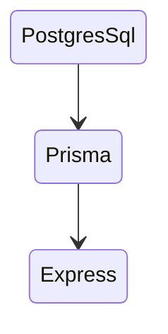
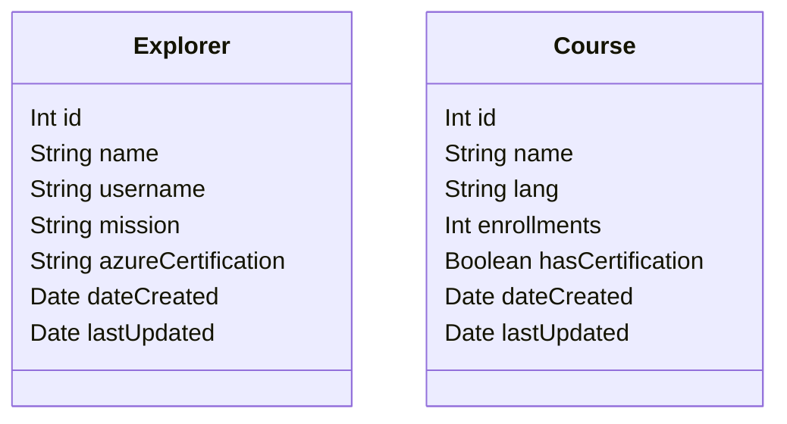

# Api: Express con Prisma DB

Api que expone enpoints para hacer operaciones CRUD sobre el recurso explorers. Se utilizó express como servidor, Postgres Sql como motor de base de datos y PrismaDB como ORM.

## Modelos

## Explorers Endpoints

### Todos los explorers

> GET /explorers

### Obtener explorer por su id

> GET /explorers/:id

### Crear un nuevo explorer

> POST /explorers

### Actualizar información de un explorer

> PUT /explorers/:id

### Eliminar un explorer

> DELETE /explorers/:id

## Courses Endpoints

### Todos los cursos

> GET /courses

### Obtener curso por su id

> GET /courses/:id

### Crear un nuevo curso

> POST /courses/

### Actualizar información de un curso

> PUT /courses/:id

### Eliminar un curso

> DELETE /courses/:id

